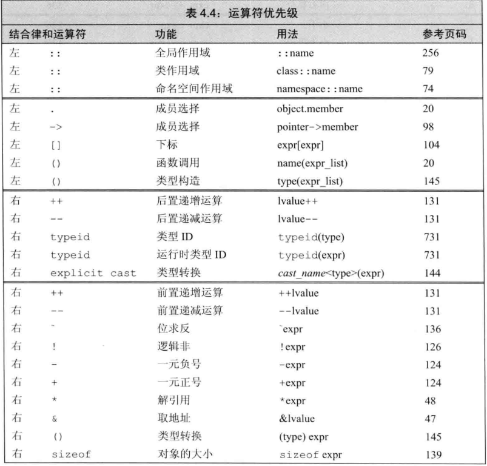

# 表达式

## 命名的强制转换
命名的强制转换如下形式  
***cast-name\<type>(expression);***

* static_cast  
    当较大的算数类型赋值给较小的类型时，static_cast可以消除警告

    ```c
    double slope = static_cast<double>(j) / i;
    ```

    对于编译器无法自动执行的类型转换也非常有用
    ```c
    void* p = &d;
    double *dp = static_cast<double *>(p);
    ```
    对于const类型
    ```c
    const char *cp;
    char *q = static_cast<char *>(cp)//错误，不能去掉const
    static_cast<string>(cp)//正确，对于字符串字面值可以转化为string
    ```
* const_cast  
  const_cast只能改变对象的底层const
    ```c
   const char *pc;
   char *p = const_cast<char *>(pc);//正确，但是通过p写值是未定义行为
    ```
    **注**:未定义行为是指C语言标准未做规定的行为。编译器可能不会报错，但是这些行为编译器会自行处理，所以不同的编译器会出现不同的结果，什么都有可能发生，这是一个极大的隐患，所以我们应该尽量避免这种情况的发生

* reinterpret_cast  
    通常为运算对象的位模式提供较低层次的重新解释。
    ```c
    int *ip;
    char *pc = reinterpret_cast<char *>(ip);
    ```
    pc所指的对象依然是一个int，如果将其当成普通字符指针使用时有可能发生错误，如`string str(pc)`

## 运算优先级表


  