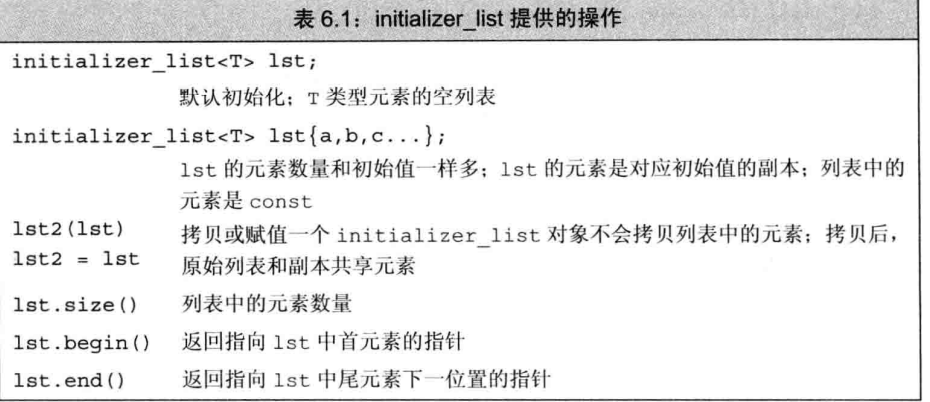

# 函数

## 管理数组实参
使用标准库规范，传递数组的首元素和尾元素指针
```c
void print(const int *begin,const int *end)
{
    while(begin != end)
    {
        cout << *begin++ << endl;
    }
}
```
或者，显示指定一个数组大小
```c
void print(const int ia[],size_t size)
{
   for(size_t i = 0; i != size ; ++i)
   {
       cout << ia[i] << endl; 
   }
}
```

### 数组的引用
```c
void print(int (&arr)][10])
{
   for(auto elem : arr)
   {
        cout << elem << endl; 
   }
}
```
## mian：预处理命令行选项

有时需要给main传递参数，假如main位于可执行文件prog中，我们可以向程序传递下面的选项

    prog -d -o ofile data0

这些命令可选两个参数传递给main

    int main(int argc, char *argv[]){}

此时`agrc = 5`,argv包含下面风格的字符串
```c
argv[0] = "prog"//argv[0]为程序名字，并非用户输入
argv[1] = "-d"
argv[2] = "-o"
argv[3] = "ofile"
argv[4] = "data0"
argv[5] = "0"
```

## 含有可变形参的函数

### initializer_list形参

如果函数的实参数量位置但类型相同，可以用`initializer_list`形。参。`initializer_list`为一种标准库类型。
操作如下


`initializer_list`与`vector`一样，都是一种模板类型

```c
initializer_list<string> ls;
initializer_list<int> li{0,1,2,3,4};
```

可以用这个编写输出错误信息的函数
```c
void error_msg(initializer_list<string> il)
{
    for(auto beg = il.begin(); beg != il.end(); ++beg)
    {
        cout << *beg << " " ;
    }
    cout << endl ;
}

error_msg({"a", "b"})
```

## 省略符形参

    void foo(...);  

## 引用返回左值
```c
char &get_val(string &str, string::size_type ix)
{
    return str[ix];
}
int main()
{
    string s("a value");
    cout << s << endl;
    get_value(s, 0) = 'A';//将s[0]的值改为A
    cout << s << endl;
    return 0;
}
```

## 列表初始化返回值
```c
vector<string> process()
{
    if(expected.empty())
    {
        return {};
    }
    else if(expected == actual)
    {
        return {"a","b"};
    }
    else
    {
        return {"a","b","c"};
    }
}
```

## 尾置类型
```c
//返回指针，指向一个含有十个整数的数组
auto func(int i) -> int(*)[10];
```
### 使用decltype
如果我们知道函数返回的指针指向哪个数组，就可以使用`decltype`

```c
int odd[] = {1,2,3,4,5};
int even[] = {2,3,4,5,6};
//返回一个指针，该指针指向一个含有5个整型的数组
decltype(odd) *arrPtr(int i)
{
    return (i % 2) ? &odd : &even;
}
```

## 函数重载
函数重载不允许除**返回值**以外其他所有要素都相同