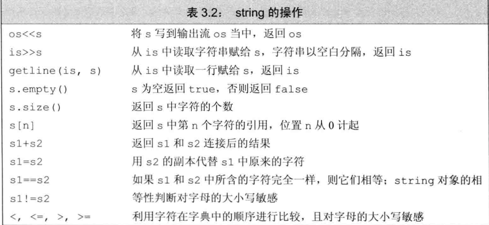
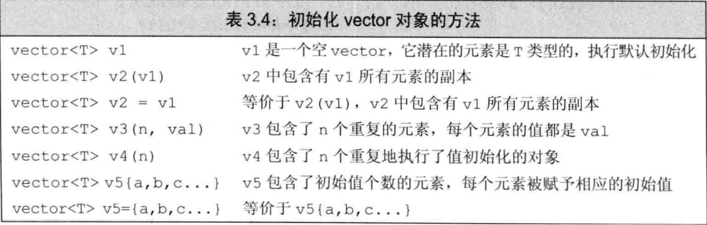
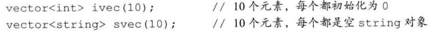
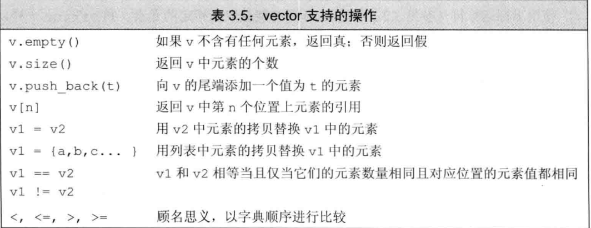
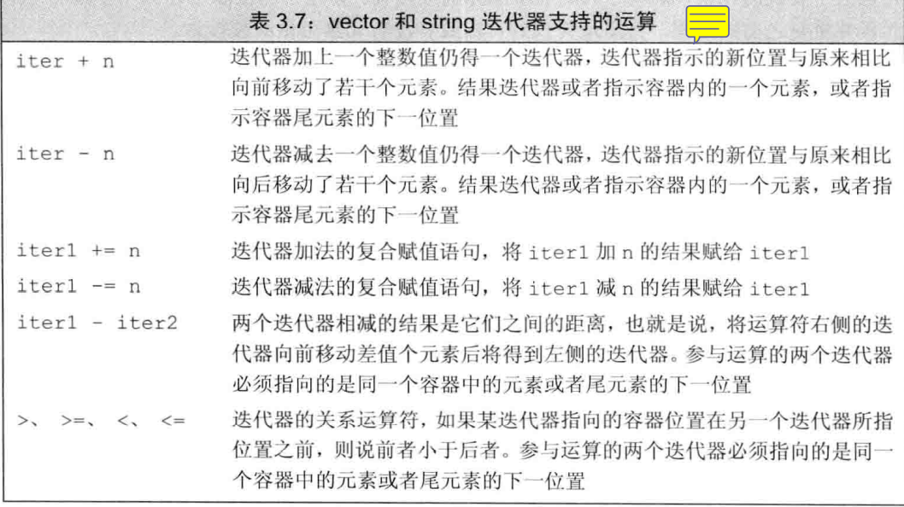

# 字符串、向量和数组

## 命名空间
> 头文件不应该包含using声明

## 标准库类型string
> 使用string需要先
```c
#include <string>
uisng std::string;
```
> 定义和初始化string
```c
string s1;//默认初始化，空字符串
string s2 = s1;//s2是s1的副本
string s3 = "hiya";//s3是字面值的副本
string s4(10,'c')//s4的内容是cccccccccc
```
```c
string s5 = "hiya"//拷贝初始化
string s6 ("hiya");//直接初始化
string s7(10,'c');//直接初始化
```

## string上的操作



## 标准库类型vector
> 使用vector需要先
```c
#include <vector>
uisng std::vector;
```
## 定义和初始化vector对象


> 值初始化





## 迭代器

```c
string s("some string");
if(s.begin() != s.end())//确保非空
{
    auto it = s.begin();//it表示s的第一个字符
    *it = toupper(*it);//将当前字符变为大写
}
//依次处理s的字符直至处理完所有字符或者遇到空白
for(auto it = s.begin(); it != s.end() && !isspace(*it); ++it){
    *it = toupper(*it);
}
```
### begin和end运算符

`begin` 和 `end`返回的具体类型有对象是否为常量决定，如果对象为常量，`begin`和`end`返回`const_iterator`；如果不是常量返回`iterator`

c++11引入了两个新函数`cbegin`和`cend`，返回`const_iterator`

**注意**：在使用了迭代器的循环体，不能添加元素


### 迭代器运算


## 标准库函数begin和end

```c
int ia[]{0,1,2,3,4,5,6};
int *beg = begin(ia);
int *last = end(ia);
```

## 使用数组初始化vector对象

```c
int int_arr[]{0,1,2,3,4,5}
vector<int> ivec(begin(int_arr), end(int_arr))
```