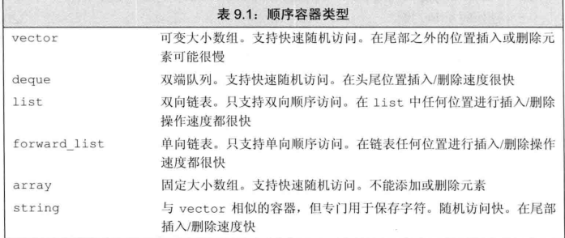
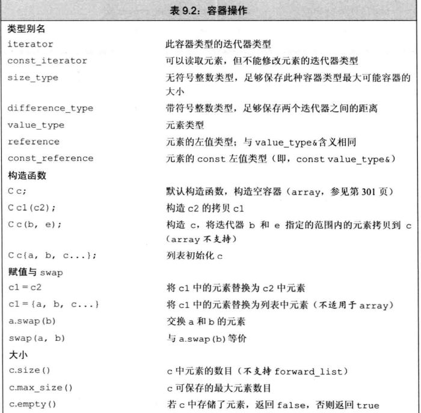
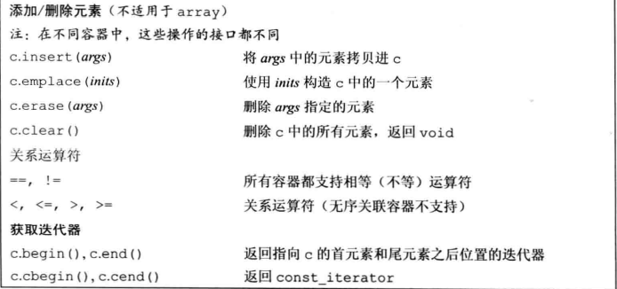
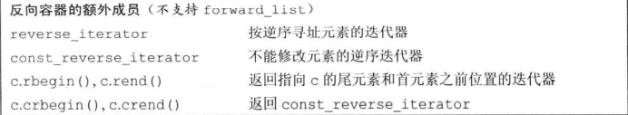

# 顺序容器

* string和vector都是将元素保存在连续的内存中，由元素下标计算地址非常快。  
但是，在这种容器的中间添加或者删除元素将变得非常耗时。

* list和forward_list 两个容器在容器的任何位置插入元素都非常快  
但是不支持随机访问，访问一个元素就要遍历整个容器  
与vector、deque和array相比，这两个容器地额外内存消耗也更大。

* deque支持快速随机访问，在两端插入或者删除很快。  
在中间位置添加或者删除元素地代价可能比较高

* forward_list和array是新c++增加地类型。  

* array与内置数组相比是一种更加安全，容易使用地数组类型。array地大小是固定的。

* forward_list的设计目标是达到手写单向链表的性能，forward_list没有size操作。



> <font color="#dddd00">通常使用vector是最好的选择</font><br />

## 容器操作





## 迭代器

### 迭代器范围
第一个迭代器begin，通常指向容器的第一个元素，第二个迭代器通常指向容器的最后一个元素之后的位置。

这种元素范围称之为**左闭合区间**

> 如果begin和end相同，则范围为空。

## 赋值和swap

```c
array<int,10> a1 = {0,1,2,3,4,5,6,7,8,9};
array<int,10> a2 = {0};//所有元素都为0

a1 = a2;//替换a1中的元素

a2 = {0}；//错误，不能将花括号列表赋予数组
```

### 容器赋值运算

```cpp
c1 = c2;//将c1中的元素替换为c2中的拷贝。c1和c2都必须具有相同的类型

c = {a,b,c,...}; //将c1中的元素替换为初始化列表中元素的拷贝（array不适用）

swap(c1,c2);
c1.swap(c2);//交换c1和c2中的元素。c1和c2必须具有相同的类型。swap通常要比从c2向c1拷贝元素快得多


//assign操作不适用与关联容器和array

seq.assign(b,e)//将seq中的元素替换为迭代器b和e所代表的范围的元素。迭代器be不能指向seq中的元素

seq.assign(il);//将seq中的元素替换为初始化列表il中的元素

seq.assign(n,t);//将seq中的元素替换为n个值为t的元素
```

### 使用assign
```cpp
list<string> names;
vector<const char*> oldstyle;
name = oldstyle;//错误：容器类型不匹配

names.assign(oldstyle.cbegin(),oldstyle.cend());//正确
```

### 使用swap

```cpp
vector<string> svec1(10);
vector<string> svec2(24);

swap(svecl,svecl);
```
 swap后svec1有24个元素，而svec2有10个元素。swap只是交换了两个容器的内部数据结构

> 除array外，swap不会对任何元素进行拷贝、删除或插入操作，因此很快。

元素不会移动意味着，除string外，指向swap、操作之后都不会失效。

比如，假定iter在swap之前指向svec1[3]的string，那么在swap之后它指向svec2[3]的元素。

对一个string调用swap会导致迭代器、引用和指针失效。

>统一使用非成员函数的swap

## 容器大小操作

### 关系运算符

* 关系运算符左右两边的运算对象都必须是相同类型的容器。
* 如果两个容器具有相同的大小且所有元素都两两对应相等，则两个容器相同，否则不同
* 如果两个容器大小不同，但较小容器的每一个元素都等于较大容器的对应元素，则较小容器小于较大容器。
* 如果两个容器都不是另一个容器的前缀子序列，那么他们的比较结果取决于第一个不相等元素的比较结果

```cpp
vector<int> v1 = {1,3,5,7,9,12};
vector<int> v2 = {1,3,9};
vector<int> v3 = {1,3,5,7};
vector<int> v4 = {1,3,5,7,9,12};

v1 < v2 //true
v1 <= v3 //false
v1 == v4 //true
v1 == v2 //false
```
> 容器的关系运算符使用元素的关系运算符完成比较
```cpp
vector<Sales_data> a,b;

if(a < b)//错误，Sales_data没有<运算符
```
